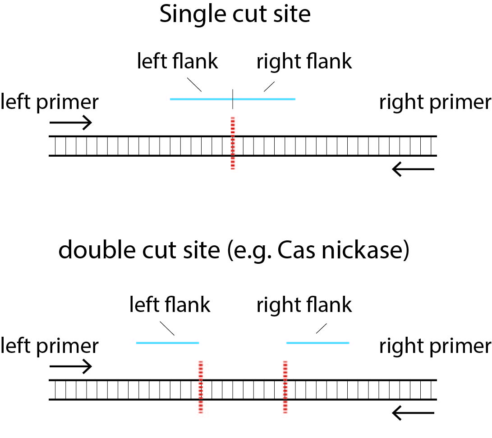

# SIQ
Sequence Interrogation and Qualification is there to perform analysis on targeted sequencing data. SIQ creates an mutation profile that can be interactively visualized using SIQPlotteR. It is written in Java so that anyone with a computer can use this program to analyse their sequences. We have designed and implemented this tool for anyone without a background in informatics to be able to analyse NGS data.

For a detailed user guide please download and read:

### [User guide](https://github.com/RobinVanSchendel/SIQ/blob/master/SIQ%20and%20SIQPlotteR%20User%20guide.docx)

And in addition you can watch the Video Turials that we have made for you to make it easy to run SIQ:

### [Video Tutorials ](#video-tutorials)

If you have watched all the videos, have read the entire user guide and still have issues with running SIQ or analysing your data, please make an issue [here](https://github.com/RobinVanSchendel/SIQ/issues) or drop us an e-mail. See SIQ paper for contact details.

For those who prefer to follow the README further, we have included a brief user guide below:

## Contents

 * [Installation](#installation)
 * [Running SIQ](#running-siq)
 * [Analysing Data with SIQPlotteR](#siqplotter)
 * [Troubleshooting](#troubleshooting)
 * [Video Tutorials](#video-tutorials)

## Installation

* Download latest Java .jar file containing SIQ from this repository [here](https://github.com/RobinVanSchendel/SIQ/releases/latest)

Download the latest .jar file from this repository. You can double click it and it should work directly. The only thing you require is a working Java version (1.8 and up). Download and install java [here](https://www.java.com/en/download/)

NOTE: Most operating systems such as MacOS and Windows distrust any file coming from the internet. For MacOS please hold 'Control' + click on the jar file to open it. This notification only appears the first time. 

## Running SIQ

when SIQ is started you should see the following screen:

<p align="center"  width="100%">
  
 </p>

SIQ can be used to analyze the following type of data:

* Sanger sequences (.ab1 files) (<b>Note: only Sanger sequences containing a single mutation can be analyzed</b>) 
* Illumina single and paired-end sequence data (.fastq or .fastq.gz files)
* PacBio data (.fastq or .fastq.gz files)

When setting up your targeted sequencing experiments you generally use two primers to amplify your locus of interest. Additionally, you (optionally) have expected target sites for your experiments. This is for example the case if you use CRISPR\Cas9, Cas13, I-SceI or any other enzyme to target the DNA. We have also used SIQ to analyze different sites, such as transposon sites, sites of G-quadruplex sequences. SIQ uses these locations to 1) try to identify sequence alterations preferably at this location. 2) to ensure your PCR primers amplified from the expected location (see [Filters](#filters) below).
  
 <p align="center"  width="100%">
    
 </p>

SIQ has the possibilities for the following input:

* R1 - sequencing file (required)
* R2 - paired end sequencing file. If provided SIQ will merge R1 and R2 using FLASH (optional)
* reference - reference file containing your DNA sequence in FASTA format. Needs to contain the primer sequences as well if supplied. Keep the reference file small as this determines the runtime of SIQ (required)
* alias - your sample name (required)
* left flank - the stretch of DNA that just touches your expected target site. See below for a graphical example (required, see [flanks](#flanks))
* right flank - the stretch of DNA that just touches your expected target site. See below for a graphical example. In the case of for example Cas9 nickases this can designate the second sgRNA target site (required)
* #bases past primer - the number of bases your sequence reads at least have to pass the primer to be included as a real event. This filter is there to make sure your primers annealed at the target site in the DNA (default: 5, 0 disables this filter)

Optional settings:
* Max reads to analyze - the maximum number of reads you want SIQ to analyze per sample (0 is unlimited)
* Min support - the minimum number an event has to be seen to be part of SIQ's output (default: 2)
* Max base error - the maximum per base error that is allowed in a read to be analyzed (default: 0.05)
* Max cpus - the maximum number of CPUs SIQ can use at any given time. Note that SIQ uses a maximum of 1 CPU per file (default: All)
* TINS search distance - the distance relative to the event junction to be included in the search space to search for the origin of insertions. A TINS is a templated insertion (default: 100)

## SIQPlotteR

When SIQ is done analysing your samples it will result in an Excel file. This Excel file can be uploaded and directly visualised by SIQPlotteR

[Upload to SIQPlotteR](https://siq.researchlumc.nl/SIQPlotter/)

See the [User Guide](#user-guide) or the [Video Tutorials](#video-tutorials) for more details on how to use SIQPlotteR.

## Troubleshooting
 
### SIQ does not start

The problem is likely that you do not have (the correct version of) Java installed. Ensure you download and install the newest Java version:
  
[Download Java](https://www.java.com/en/download/)

### SIQ still does not start

Start SIQ from within a terminal (command prompt in windows):

  1. Start a terminal
  2. Go to the directory where the SIQ jar file is (for example Downloads): `cd Downloads`
  3. Start SIQ (in this example the file is SIQ_1.0.jar: `java -jar SIQ_1.0.jar` 
  4. Post the output as an [issue](https://github.com/RobinVanSchendel/SIQ/issues).

### SIQ does not work on files that need merging of paired-end reads
  
The program Flash that is required for you operating system seems to be not working. When starting SIQ, Flash is copied to the directory that SIQ is running in. It might be that the program does not work for your operating system. Please check the output of the following commmands to see if Flash is working
  
  1. Start a terminal
  2. Go to the directory where the SIQ jar file is (for example Downloads): `cd Downloads`
  3. Run flash like this (Linux/MacOs)
  ```
    ./flash2  
      Usage: flash [OPTIONS] MATES_1.FASTQ MATES_2.FASTQ
      Run `./flash2 --help | less' for more information.
  ```
     or in windows:
  ```
    flash.exe
      Usage: flash [OPTIONS] MATES_1.FASTQ MATES_2.FASTQ
      Run `flash.exe --help | more' for more information.
  ```
   4. if the output is different, please post the output as an [issue](https://github.com/RobinVanSchendel/SIQ/issues). 
See the User Guide for more options
   
## Video Tutorials

Video 1. Download & Installing SIQ

[](https://www.youtube.com/watch?v=O15Z4ohQ2VU "Download & Installing SIQ")

Video 2. Running SIQ on your data

[](https://www.youtube.com/watch?v=bgqxioQfYkU "Running SIQ")

Video 3. Running SIQ with an HDR reference to detect edits
  
[](https://www.youtube.com/watch?v=F6PmLzDAA5g "Detect HDR with SIQ")

Video 4. Advanced SIQ options

[](https://www.youtube.com/watch?v=i8Grk_ndzwI "Advanced SIQ options")
  
Video 5. Analysing data using SIQPlotteR

[](https://www.youtube.com/watch?v=If22p8KB4OI "SIQPlotteR")
